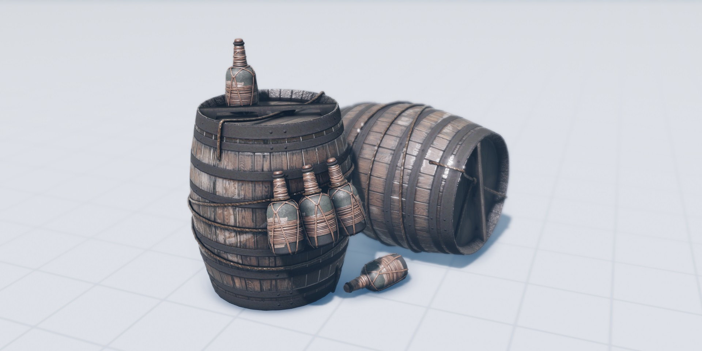

# PyApplyLUT

Apply .cube file on image in python


The [LUT.h](https://github.com/ray-cast/lut) wrapper for python. Support both .cube file and numpy lut format.

## Build and Install

### requirements:
- pybind11
- eigen
- the C++ compiler support C++14 and openmp

### install: 

```
mkdir build
cmake ..
add the generated .so file to the path where python can find it.
```

## How to use
```python
import cv2
import numpy as np
from pathlib2 import Path

import sys
# the path of .so where python can find it
sys.path.append("Q:/WorkSpace/bfood/lut-master/build/Debug")
from python.PyApplyLUT import PyApplyLUT
from python.lut_tools import cube_to_npy

INPUT_IMG = Path(r".\test\1.jpg")
LUT_FILE = Path(r".\test\1.cube")

# normlizer the input picture to 0~1
img = cv2.imread(INPUT_IMG.as_posix())
img = img / 255

# apply lut 

# method 1 load lut from a .cube file
alut = PyApplyLUT(lut_file=LUT_FILE)
new_img = alut.apply_lut(img)
# recover to 0~255
new_img = new_img * 255
cv2.imwrite("./test/new_img_1.jpg",new_img)

# method 2 load lut from the np array
cubenpy = cube_to_npy(LUT_FILE)
alut = PyApplyLUT(lut_dim=32, lut_cube=cubenpy)
new_img = alut.apply_lut(img)
# recover to 0~255
new_img = new_img * 255
cv2.imwrite("./test/new_img_2.jpg",new_img)
```

The origin image: 

The applyed lut image

